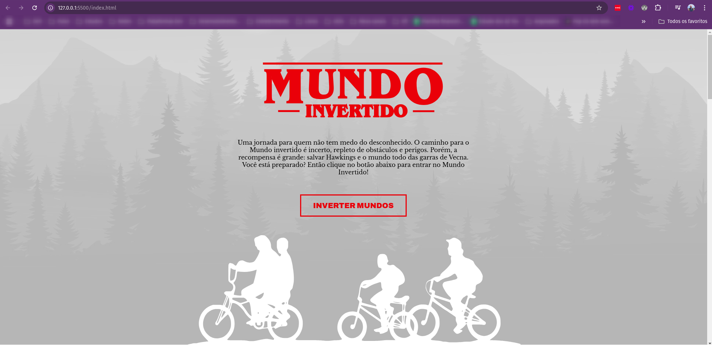

<h1 align="center">Mundo Invertido</h1>

  
  

  

## 📝 Projeto

Projeto construído para fins didáticos, com o objetivo de colocar em
prática os conhecimentos de HTML, CSS e JavaScript aprendidos na DIO._

  